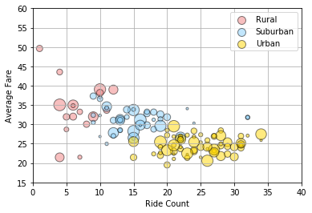
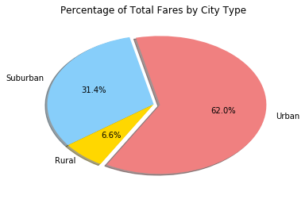
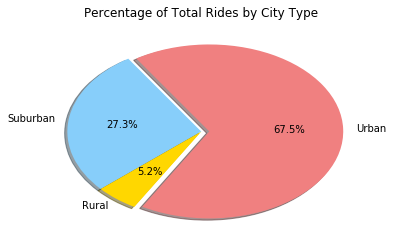
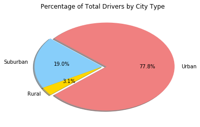

```python
#Observed trend 1: Rural city types had the fewest number of total rides, but had the highest average fare. 
                 # This could perhapes be explained by the distance that the average person lives from the city center.
#Observed trend 2: The average fare generally decreased as number of rides increased by city.
#Observed trend 3: There is far more variance between average fare and ride value in rural cities versus urban cities. 
                 # The fact that there were far fewer total rides in the rural communities most likely allowed for a higher number
                 # of outliers in the data.
```


```python
import matplotlib.pyplot as plt
import pandas as pd
import seaborn as sns
```


```python
city_df = pd.read_csv("city_data.csv")
ride_df = pd.read_csv("ride_data.csv")
city_df.head()
```


<div>
<style>
    .dataframe thead tr:only-child th {
        text-align: right;
    }

    .dataframe thead th {
        text-align: left;
    }

    .dataframe tbody tr th {
        vertical-align: top;
    }
</style>
<table border="1" class="dataframe">
  <thead>
    <tr style="text-align: right;">
      <th></th>
      <th>city</th>
      <th>driver_count</th>
      <th>type</th>
    </tr>
  </thead>
  <tbody>
    <tr>
      <th>0</th>
      <td>Kelseyland</td>
      <td>63</td>
      <td>Urban</td>
    </tr>
    <tr>
      <th>1</th>
      <td>Nguyenbury</td>
      <td>8</td>
      <td>Urban</td>
    </tr>
    <tr>
      <th>2</th>
      <td>East Douglas</td>
      <td>12</td>
      <td>Urban</td>
    </tr>
    <tr>
      <th>3</th>
      <td>West Dawnfurt</td>
      <td>34</td>
      <td>Urban</td>
    </tr>
    <tr>
      <th>4</th>
      <td>Rodriguezburgh</td>
      <td>52</td>
      <td>Urban</td>
    </tr>
  </tbody>
</table>
</div>


```python
pyber_df = pd.merge(city_df, ride_df, on="city", how="outer")

pyber_df.head()
```


<div>
<style>
    .dataframe thead tr:only-child th {
        text-align: right;
    }

    .dataframe thead th {
        text-align: left;
    }

    .dataframe tbody tr th {
        vertical-align: top;
    }
</style>
<table border="1" class="dataframe">
  <thead>
    <tr style="text-align: right;">
      <th></th>
      <th>city</th>
      <th>driver_count</th>
      <th>type</th>
      <th>date</th>
      <th>fare</th>
      <th>ride_id</th>
    </tr>
  </thead>
  <tbody>
    <tr>
      <th>0</th>
      <td>Kelseyland</td>
      <td>63</td>
      <td>Urban</td>
      <td>2016-08-19 04:27:52</td>
      <td>5.51</td>
      <td>6246006544795</td>
    </tr>
    <tr>
      <th>1</th>
      <td>Kelseyland</td>
      <td>63</td>
      <td>Urban</td>
      <td>2016-04-17 06:59:50</td>
      <td>5.54</td>
      <td>7466473222333</td>
    </tr>
    <tr>
      <th>2</th>
      <td>Kelseyland</td>
      <td>63</td>
      <td>Urban</td>
      <td>2016-05-04 15:06:07</td>
      <td>30.54</td>
      <td>2140501382736</td>
    </tr>
    <tr>
      <th>3</th>
      <td>Kelseyland</td>
      <td>63</td>
      <td>Urban</td>
      <td>2016-01-25 20:44:56</td>
      <td>12.08</td>
      <td>1896987891309</td>
    </tr>
    <tr>
      <th>4</th>
      <td>Kelseyland</td>
      <td>63</td>
      <td>Urban</td>
      <td>2016-08-09 18:19:47</td>
      <td>17.91</td>
      <td>8784212854829</td>
    </tr>
  </tbody>
</table>
</div>


```python
# construct dataframes
Average_Fare = pd.DataFrame(ride_df.groupby("city")["fare"].mean())
Average_Fare = Average_Fare.reset_index()

Total_Rides = pd.DataFrame(ride_df.groupby("city")["ride_id"].count())
Total_Rides = Total_Rides.rename(columns={"city": "City", "ride_id": "Ride Count"})
Total_Rides = Total_Rides.reset_index()

Driver_Count = pd.DataFrame(city_df.groupby("city")["driver_count"].sum())
Driver_Count = Driver_Count.reset_index()

Type = city_df[["city", "type"]].drop_duplicates()
Type = pd.DataFrame(city_df.drop_duplicates())
Type = Type.reset_index()
Type = Type[["city", "type"]]

#merge dataframes

pyber_merge_1 = pd.merge(Average_Fare, Total_Rides, on="city", how="inner")

pyber_merge_2 = pd.merge(pyber_merge_1, Driver_Count, on="city", how="inner")

pyber_merge_3 = pd.merge(pyber_merge_2, Type, on="city", how="inner")

pyber_df_final = pyber_merge_3

pyber_df_final = pyber_df_final.rename(columns={"city": "City", "fare": "Average Fare", "driver_count": "Driver Count", "type": "City Type"})

pyber_df_final.head()
```


<div>
<style>
    .dataframe thead tr:only-child th {
        text-align: right;
    }

    .dataframe thead th {
        text-align: left;
    }

    .dataframe tbody tr th {
        vertical-align: top;
    }
</style>
<table border="1" class="dataframe">
  <thead>
    <tr style="text-align: right;">
      <th></th>
      <th>City</th>
      <th>Average Fare</th>
      <th>Ride Count</th>
      <th>Driver Count</th>
      <th>City Type</th>
    </tr>
  </thead>
  <tbody>
    <tr>
      <th>0</th>
      <td>Alvarezhaven</td>
      <td>23.928710</td>
      <td>31</td>
      <td>21</td>
      <td>Urban</td>
    </tr>
    <tr>
      <th>1</th>
      <td>Alyssaberg</td>
      <td>20.609615</td>
      <td>26</td>
      <td>67</td>
      <td>Urban</td>
    </tr>
    <tr>
      <th>2</th>
      <td>Anitamouth</td>
      <td>37.315556</td>
      <td>9</td>
      <td>16</td>
      <td>Suburban</td>
    </tr>
    <tr>
      <th>3</th>
      <td>Antoniomouth</td>
      <td>23.625000</td>
      <td>22</td>
      <td>21</td>
      <td>Urban</td>
    </tr>
    <tr>
      <th>4</th>
      <td>Aprilchester</td>
      <td>21.981579</td>
      <td>19</td>
      <td>49</td>
      <td>Urban</td>
    </tr>
  </tbody>
</table>
</div>


```python
# Bubble Chart
fig, ax = plt.subplots()
groups = pyber_df_final.groupby('City Type')
colors = ["lightcoral", "lightskyblue", "gold"]
for i, (name, group) in enumerate(groups):
    group.plot(kind='scatter', x='Ride Count', y='Average Fare', ylim=((15, 55)), xlim=((0, 40)), s=pyber_df_final["Driver Count"].values*3, label=name, ax=ax, color=colors[i], edgecolor="black", alpha=.5)
lgd = ax.legend(numpoints=1)
for handle in lgd.legendHandles:
    handle.set_sizes([100.0])
ax.set_ylim((15, 55))
plt.title("Pyber Ride Sharing Data 2016")
plt.grid()
plt.show()
```





```python
#Percentage of Total Fares by City Type
city_type_group = pyber_df.groupby(["type"])

Total_Fares = ride_df["fare"].sum()

city_fares_percent_df = pd.DataFrame(pyber_df["type"].value_counts().reset_index())

city_fares_percent_df = city_fares_percent_df.rename(columns={"index": "City Type", "type": "Count"})

city_fares_percent_df = city_fares_percent_df.set_index("City Type")

city_fares_percent_df["Total Fares"] = city_type_group["fare"].sum()

city_fares_percent_df["Percentage of Fares"] = round(((city_fares_percent_df["Total Fares"]/Total_Fares)*100),2)

sizes = city_fares_percent_df["Percentage of Fares"]
explode = [0.06, 0, 0]
labels = city_fares_percent_df.index
colors = ["lightcoral", "lightskyblue", "gold"]
plt.pie(sizes, explode=explode, labels=labels, colors=colors, autopct="%1.1f%%", shadow=True, startangle=240)
plt.title("Percentage of Total Fares by City Type")
plt.show()
```





```python
#Percentage of Total Rides by City Type
city_rides_percent_df = pd.DataFrame(pyber_df["type"].value_counts().reset_index())

city_rides_percent_df = city_rides_percent_df.rename(columns={"index": "City Type", "type": "Count"})

Total_Rides = city_rides_percent_df["Count"].sum()

city_rides_percent_df["Percent of Rides"] = round(((city_rides_percent_df["Count"]/Total_Rides)*100),2)

sizes = city_rides_percent_df["Percent of Rides"]
explode = [0.06, 0, 0]
labels = city_fares_percent_df.index
colors = ["lightcoral", "lightskyblue", "gold"]
plt.pie(sizes, explode=explode, labels=labels, colors=colors, autopct="%1.1f%%", shadow=True, startangle=240)
plt.title("Percentage of Total Rides by City Type")
plt.show()
```





```python
#Percent of Total Drivers by City Type
city_drivers_df = pd.DataFrame(city_df.groupby("type")["driver_count"].sum())

city_drivers_df = city_drivers_df.reset_index()

city_drivers_df = city_drivers_df.rename(columns={"type": "City Type", "driver_count": "Driver Count"})

city_drivers_df = city_drivers_df.set_index("City Type")

Driver_Count = city_drivers_df["Driver Count"].sum()

city_drivers_df["Percentage of Drivers"] = round(((city_drivers_df["Driver Count"]/Driver_Count)*100),2)

city_drivers_df = city_drivers_df.sort_values(by="Percentage of Drivers", ascending=False)

sizes = city_drivers_df["Percentage of Drivers"]
explode = [0.06, 0, 0]
labels = city_fares_percent_df.index
colors = ["lightcoral", "lightskyblue", "gold"]
plt.pie(sizes, explode=explode, labels=labels, colors=colors, autopct="%1.1f%%", shadow=True, startangle=220)
plt.title("Percentage of Total Drivers by City Type")
plt.show()

```




